# DiningConcierge 프로젝트 진행 기록

> AWS Bedrock AgentCore 기반 강남 식당 추천 AI 에이전트 — 풀스택 구축 과정 상세 기록  
> 계정: 678498164624 | 리전: us-west-2 | 마지막 업데이트: 2026-08-04

---

## 전체 아키텍처

```
┌─────────────────────────────────────────────────────────────────────┐
│  사용자 (브라우저)                                                    │
└──────────────┬──────────────────────────────────────────────────────┘
               ▼
┌──────────────────────────┐
│  CloudFront (CDN)        │ ← STEP 6
│  └─ S3 (React 정적 파일) │
└──────────────┬───────────┘
               │ POST /chat
               ▼
┌──────────────────────────┐
│  API Gateway → Lambda    │ ← STEP 5
│  (경량 프록시, 256MB)     │
│  boto3 invoke만 수행      │
└──────────────┬───────────┘
               │ invoke_agent_runtime()
               ▼
┌──────────────────────────────────────────────────────────────────┐
│  AgentCore Runtime (풀기능 에이전트)                     ← STEP 3 │
│                                                                    │
│  ┌─────────────────────────────────────────────────────────────┐  │
│  │  Strands Agent (도구 자동 선택)                    ← STEP 2  │  │
│  │                                                               │  │
│  │  ├─ search_restaurants → Bedrock KB (벡터 검색)    ← STEP 1  │  │
│  │  ├─ get_menu → Bedrock KB (식당명 필터)                       │  │
│  │  ├─ MCP Server (stdio) → 예약 / 비용 산정 도구              │  │
│  │  ├─ Web Search Gateway (us-east-1) → 실시간 웹 검색 ← STEP 4│  │
│  │  └─ Memory → 사용자 취향 저장/검색               ← STEP 4   │  │
│  └─────────────────────────────────────────────────────────────┘  │
│                              │                                      │
│                              ▼                                      │
│                    Bedrock Nova Lite → 응답 생성                    │
└──────────────────────────────────────────────────────────────────┘

CI/CD: GitHub Actions (경로 필터 + Strands Evals 평가 게이트) ← STEP 7
자동화: setup.sh --all (원커맨드 전체 재현)                    ← STEP 8
```

### 요청 흐름 (Request Flow)

```
1. 사용자 입력 → React ChatBubble UI
2. fetch(POST /chat) → CloudFront → API Gateway
3. Lambda: invoke_agent_runtime(RUNTIME_ARN, payload)
4. AgentCore Runtime 내 Strands Agent:
   - 질문 분석 → 적합한 도구 자동 선택
   - 도구 실행 (KB검색 / MCP호출 / Memory / WebSearch)
   - Nova Lite로 최종 응답 생성
5. SSE 스트리밍 → Lambda에서 조합 → JSON 반환
6. React UI에서 ChatBubble로 렌더링
```

---

## STEP 1 — 인프라 + Knowledge Base 구축

### 무엇을 했나 (What)

#### 1-1. CloudFormation으로 기반 인프라 배포

```yaml
# 00-infra.yaml → dining-infra 스택
Resources:
  - KBDataBucket:      dining-kb-data-678498164624      (KB 원본 데이터 저장)
  - FrontendBucket:    dining-frontend-678498164624     (React 빌드 파일)
  - KBRole:            dining-kb-role                   (Bedrock → S3/OpenSearch 접근)
  - GatewayRole:       dining-gateway-role              (AgentCore → WebSearch 접근)
```

실행: `aws cloudformation deploy --template-file 00-infra.yaml --stack-name dining-infra`

#### 1-2. OpenSearch Serverless 컬렉션 생성

벡터 검색을 위한 서버리스 검색 엔진을 구성합니다:

1. **Encryption Policy** — 컬렉션 데이터 암호화 (AWS 관리형 키)
2. **Network Policy** — 퍼블릭 접근 허용 (Bedrock KB가 접근 가능하도록)
3. **Data Access Policy** — KB 역할 + 현재 사용자에게 인덱스 CRUD 권한 부여
4. **Collection 생성** — `dining-kb-collection` (VECTORSEARCH 타입)
5. **ACTIVE 대기** — 컬렉션 활성화까지 최대 10분 폴링

#### 1-3. 벡터 인덱스 생성

```python
# OpenSearch에 knn_vector 인덱스 생성
{
    "settings": {"index.knn": True},
    "mappings": {
        "properties": {
            "vector": {
                "type": "knn_vector",
                "dimension": 1024,          # Titan Embed V2 출력 차원
                "method": {
                    "engine": "faiss",      # Facebook AI Similarity Search
                    "name": "hnsw"          # Hierarchical Navigable Small World
                }
            },
            "text": {"type": "text"},       # 원본 텍스트 청크
            "metadata": {"type": "text"}    # 메타데이터 (카테고리, 가격대 등)
        }
    }
}
```

#### 1-4. Bedrock Knowledge Base 생성

```bash
aws bedrock-agent create-knowledge-base \
  --name "dining-restaurants-kb" \
  --role-arn "arn:aws:iam::678498164624:role/dining-kb-role" \
  --knowledge-base-configuration '{
    "type": "VECTOR",
    "vectorKnowledgeBaseConfiguration": {
      "embeddingModelArn": "arn:aws:bedrock:us-west-2::foundation-model/amazon.titan-embed-text-v2:0",
      "embeddingModelConfiguration": {
        "bedrockEmbeddingModelConfiguration": {"dimensions": 1024}
      }
    }
  }' \
  --storage-configuration '{
    "type": "OPENSEARCH_SERVERLESS",
    "opensearchServerlessConfiguration": {
      "collectionArn": "arn:aws:aoss:us-west-2:678498164624:collection/wcuhxgd2o1syxk3axwnb",
      "fieldMapping": {"metadataField": "metadata", "textField": "text", "vectorField": "vector"},
      "vectorIndexName": "bedrock-knowledge-base-default-index"
    }
  }'
```

#### 1-5. 데이터 업로드 + 동기화(Ingestion)

- S3에 식당 문서 8개(docx) + 메타데이터(json) + 요약 엑셀 업로드
- Data Source 생성 → `start-ingestion-job` 호출
- Bedrock이 자동으로: **문서 파싱 → 청킹 → Titan Embed V2로 임베딩 → OpenSearch에 벡터 저장**

### 왜 필요한가 (Why)

**RAG(Retrieval-Augmented Generation)의 근간입니다.**

LLM(Nova Lite)은 학습 데이터에 없는 식당 정보를 알 수 없습니다. RAG 패턴을 통해:

1. 사용자 질문을 벡터로 변환 (임베딩)
2. OpenSearch에서 유사한 벡터를 검색 (벡터 유사도)
3. 검색된 식당 정보를 LLM에 컨텍스트로 제공
4. LLM이 실제 데이터를 기반으로 답변 생성 → **환각(Hallucination) 방지**

### 핵심 개념 설명

| 개념 | 설명 |
|------|------|
| **RAG** | Retrieval-Augmented Generation. 검색으로 보강된 생성. LLM에 외부 지식을 주입하는 패턴 |
| **Vector DB** | 벡터(숫자 배열)를 저장하고 유사도로 검색하는 데이터베이스. 텍스트를 의미 기반으로 검색 가능 |
| **Embedding** | 텍스트를 고정 길이 벡터(1024차원)로 변환. 의미가 유사한 텍스트는 벡터도 가까움 |
| **OpenSearch Serverless** | AWS 관리형 검색 엔진. VECTORSEARCH 타입은 kNN 검색 최적화. 서버 관리 불필요 |
| **Knowledge Base** | Bedrock의 관리형 RAG 서비스. S3 → 청킹 → 임베딩 → 벡터DB 파이프라인 자동 관리 |
| **Ingestion** | 데이터 소스(S3)에서 문서를 가져와 청킹+임베딩하여 벡터DB에 저장하는 과정 |
| **Chunking** | 긴 문서를 LLM이 처리 가능한 작은 단위로 분할. 각 청크가 독립적으로 검색됨 |
| **HNSW** | Hierarchical Navigable Small World. 근사 최근접 이웃 검색 알고리즘. 빠르고 정확 |
| **FAISS** | Facebook AI Similarity Search. 대규모 벡터 유사도 검색 라이브러리 |

### 📸 필요한 캡처

| # | 위치 | 캡처 내용 |
|---|------|-----------|
| 1 | AWS 콘솔 → S3 → `dining-kb-data-678498164624` | `restaurant-docs/` 폴더 내 17개 파일 목록 (docx 8 + metadata json 8 + xlsx 1) |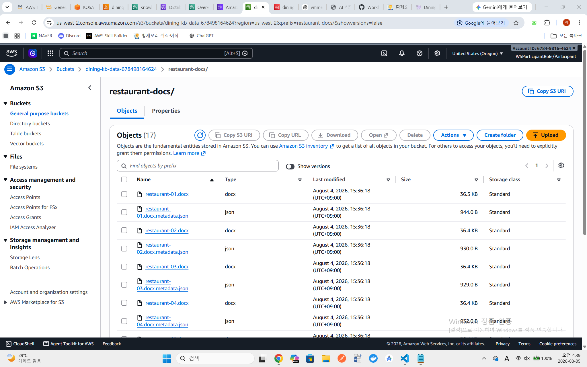
| 2 | AWS 콘솔 → OpenSearch Serverless → Collections | `dining-kb-collection` ACTIVE 상태 화면 | 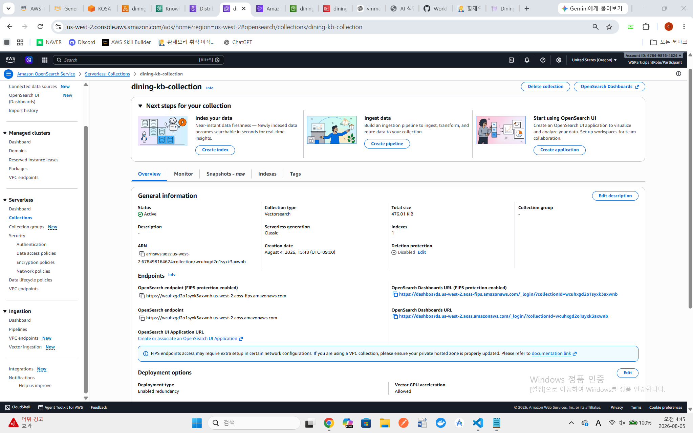
| 3 | AWS 콘솔 → Bedrock → Knowledge Bases | `dining-restaurants-kb` Active 상태 + Data Source 연결 | 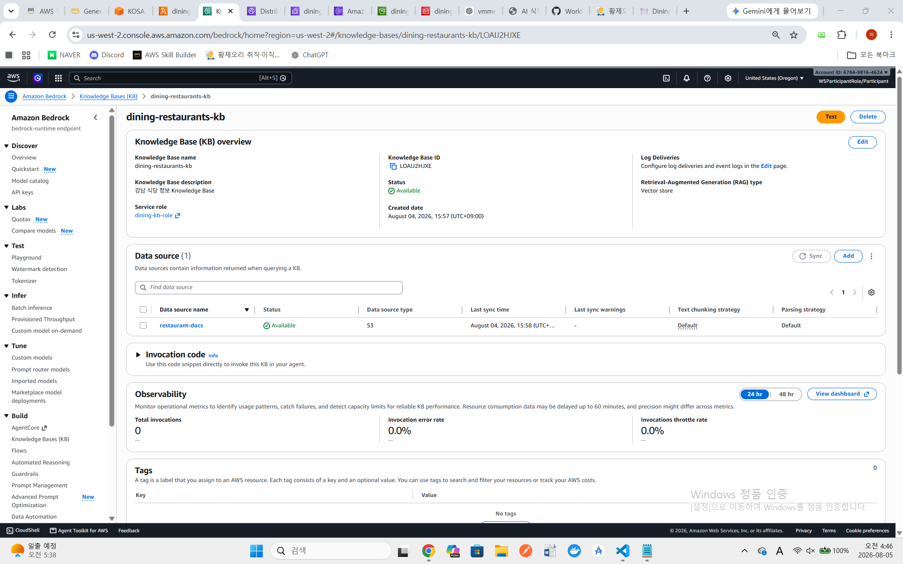
| 4 | AWS 콘솔 → Bedrock → KB → Sync | Ingestion Job 완료 (COMPLETE) 상태 | 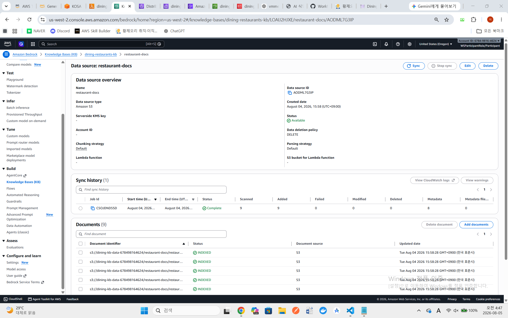
| 5 | 터미널 | `01-kb/setup-kb.sh` 실행 전체 로그 (KB_ID=LOAIJ2HJXE 출력) |

---

## STEP 2 — Strands Agent + MCP 도구 개발

### 무엇을 했나 (What)

#### 2-1. KB 검색 도구 (`tools.py`)

Strands Agents SDK의 `@tool` 데코레이터로 도구를 정의합니다:

```python
@tool
def search_restaurants(query: str, category: str = "") -> str:
    """강남 지역 식당을 검색합니다.
    Args:
        query: 검색 질문 (예: "데이트하기 좋은 식당")
        category: 카테고리 필터 (한식, 일식, 이탈리안 등)
    """
    filter_config = {"equals": {"key": "category", "value": category}} if category else None
    results = bedrock_agent_runtime.retrieve(
        knowledgeBaseId="LOAIJ2HJXE",
        retrievalQuery={"text": query},
        retrievalConfiguration={"vectorSearchConfiguration": {
            "numberOfResults": 5,
            "filter": filter_config
        }}
    )
    return formatted_results

@tool
def get_menu(restaurant_name: str) -> str:
    """특정 식당의 메뉴와 가격 정보를 조회합니다."""
    results = retrieve(f"{restaurant_name} 메뉴 가격")
    relevant = [r for r in results if restaurant_name in r["text"]]
    return formatted_menu
```

#### 2-2. MCP 서버 (`mcp_server.py`)

Model Context Protocol로 예약/비용 도구를 별도 서버로 분리:

```python
# MCP 서버 — stdio 전송 방식
@mcp.tool()
def check_reservation(restaurant_name: str, date: str, time: str, party_size: int) -> dict:
    """예약 가능 여부 조회"""

@mcp.tool()
def create_reservation(restaurant_name: str, date: str, time: str, 
                       party_size: int, customer_name: str) -> dict:
    """예약 생성"""

@mcp.tool()
def estimate_cost(restaurant_name: str, party_size: int, menu_items: list) -> dict:
    """인원수 + 메뉴별 예상 비용 산정"""
```

#### 2-3. 에이전트 자동 도구 선택

Strands Agent는 시스템 프롬프트와 도구 설명(docstring)을 기반으로 **질문에 따라 자동으로 적합한 도구를 선택**합니다:

```
사용자: "이탈리안 식당 추천해줘"
  → Agent 판단: search_restaurants(query="이탈리안", category="이탈리안")

사용자: "서울갈비 메뉴 알려줘"
  → Agent 판단: get_menu(restaurant_name="서울갈비 강남본점")

사용자: "트라토리아 4명 예약해줘"
  → Agent 판단: check_reservation → create_reservation (도구 체이닝)

사용자: "이탈리안 추천하고 4명 예산도 알려줘"
  → Agent 판단: search_restaurants → estimate_cost (복합 질문 → 다중 도구)
```

### 왜 필요한가 (Why)

**LLM 단독으로는 외부 시스템과 상호작용할 수 없습니다.**

- LLM은 텍스트 생성만 가능 → 실시간 데이터(식당 정보, 예약 현황)에 접근 불가
- **Tool Use (도구 사용)**: LLM이 "어떤 도구를 어떤 인자로 호출할지" 결정 → 외부 시스템 연동
- MCP로 도구를 별도 프로세스로 분리 → 에이전트 코드와 독립적으로 개발/배포 가능
- 도구 체이닝: 하나의 질문에 여러 도구를 순차 호출하여 복잡한 작업 수행

### 핵심 개념 설명

| 개념 | 설명 |
|------|------|
| **Tool Use** | LLM이 사전 정의된 함수를 호출하는 패턴. LLM은 인자를 결정하고, 실행은 런타임이 담당 |
| **Strands Agents SDK** | AWS의 에이전트 프레임워크. `@tool` 데코레이터로 도구 정의, `Agent` 클래스로 오케스트레이션 |
| **@tool 데코레이터** | 함수를 도구로 등록. docstring이 LLM에게 도구 설명으로 제공되어 호출 판단 근거가 됨 |
| **MCP (Model Context Protocol)** | Anthropic이 제안한 도구 연결 표준 프로토콜. 서버-클라이언트 구조로 도구를 노출 |
| **stdio transport** | MCP 전송 방식 중 하나. 표준 입출력(stdin/stdout)으로 통신. 같은 머신에서 실행 |
| **Tool Chaining** | 하나의 질문 해결을 위해 여러 도구를 순차적으로 호출. Agent가 자동으로 판단 |
| **Reasoning** | Agent가 어떤 도구를 호출할지 "생각"하는 과정. 시스템 프롬프트 + 도구 설명 기반 |

### 📸 필요한 캡처

| # | 위치 | 캡처 내용 |
|---|------|-----------|
| 1 | 터미널 | 에이전트 실행 로그 — 도구 호출 과정 (search → menu → reservation 체이닝) |
| 2 | Streamlit 앱 | 채팅 대화 화면 + 사이드바 도구 호출 로그 |
| 3 | Streamlit 앱 | 식당 카드 UI (이름/카테고리/가격대/위치/분위기 구조화 출력) | 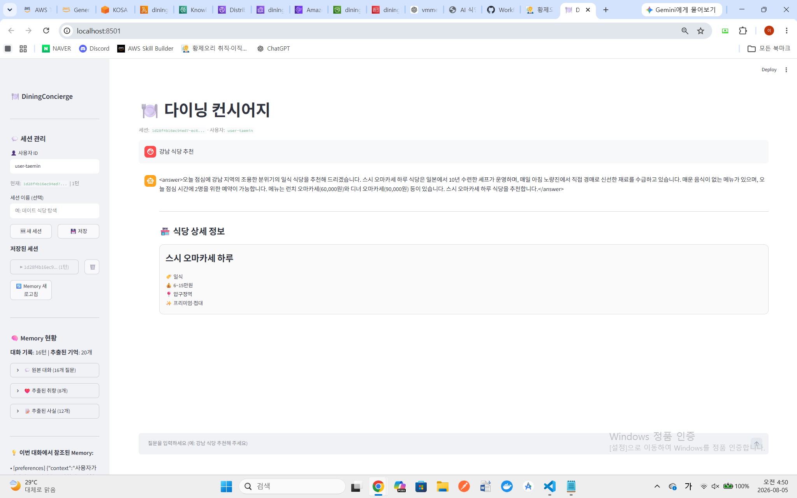
| 4 | 코드 | `tools.py` 핵심 — `@tool` + `retrieve()` 호출 부분 |
| 5 | 코드 | `mcp_server.py` 핵심 — 3개 MCP 도구 정의 부분 |

---

## STEP 3 — AgentCore Runtime 배포

### 무엇을 했나 (What)

#### 3-1. AgentCore 프로젝트 생성

```bash
cd 02-agent
npx @aws/agentcore create
# → agentcore/ 디렉토리 생성:
#   ├── agentcore.json    (프로젝트 설정 — 런타임, 메모리, 게이트웨이 정의)
#   ├── aws-targets.json  (배포 대상 리전)
#   └── cdk/              (CDK 인프라 코드 — TypeScript)
```

#### 3-2. `agentcore.json` 설정

```json
{
  "name": "DiningConcierge",
  "version": 1,
  "managedBy": "CDK",
  "runtimes": [
    {
      "name": "DiningConcierge",
      "build": "CodeZip",           // Python 코드를 zip으로 패키징
      "entrypoint": "main.py",     // 실행 진입점
      "codeLocation": "app/DiningConcierge/",  // 소스 코드 경로
      "runtimeVersion": "PYTHON_3_14",
      "networkMode": "PUBLIC",     // 외부에서 호출 가능
      "protocol": "HTTP"           // HTTP 프로토콜
    }
  ]
}
```

#### 3-3. 배포 실행

```bash
npx @aws/agentcore deploy --yes --verbose
# 내부 동작:
# 1. pyproject.toml 기반 의존성 수집 (uv로 빠른 설치)
# 2. app/DiningConcierge/ 코드를 zip으로 패키징 (CodeZip build)
# 3. CDK bootstrap (첫 배포 시)
# 4. CloudFormation 스택 배포 → Runtime 리소스 생성
# 5. 코드 업로드 → Runtime 상태: CREATING → READY
```

#### 3-4. 배포 결과 확인

```bash
npx @aws/agentcore status
# Runtime: DiningConcierge_DiningConcierge-aLEpSdHOiw
# Status: READY
# ARN: arn:aws:bedrock-agentcore:us-west-2:678498164624:runtime/DiningConcierge_DiningConcierge-aLEpSdHOiw
```

### 왜 필요한가 (Why)

**로컬에서 개발한 에이전트를 프로덕션에서 안정적으로 서빙해야 합니다.**

- 로컬 실행(Streamlit)은 개발/테스트 용도 → 24/7 서비스 불가
- AgentCore Runtime이 제공하는 것:
  - **관리형 인프라**: 서버 프로비저닝/패치 불필요
  - **자동 스케일링**: 트래픽에 따라 인스턴스 자동 조절
  - **HTTPS 엔드포인트**: 어디서든 호출 가능 (Lambda, CLI, 다른 서비스)
  - **무중단 배포**: 새 버전이 READY된 후 트래픽 전환 (blue-green)
  - **모니터링**: 호출 로그, 에러율, 지연시간 자동 수집

### 핵심 개념 설명

| 개념 | 설명 |
|------|------|
| **AgentCore Runtime** | Bedrock의 관리형 에이전트 실행 환경. 코드를 업로드하면 서버리스 엔드포인트로 서빙 |
| **CodeZip build** | Python 코드 + 의존성을 zip으로 패키징하는 빌드 방식. `uv`로 빠른 의존성 해결 |
| **CDK (Cloud Development Kit)** | TypeScript/Python으로 AWS 인프라를 정의. `agentcore deploy`가 내부적으로 CDK 사용 |
| **Managed Endpoint** | AWS가 관리하는 HTTP 엔드포인트. 호출자는 ARN으로 접근 |
| **Serverless** | 서버 관리 없이 코드만 배포. 사용한 만큼만 과금, 자동 스케일링 |
| **Blue-Green Deployment** | 새 버전을 별도 환경에 준비 → 준비 완료 시 트래픽 전환. 다운타임 0 |

### 📸 필요한 캡처

| # | 위치 | 캡처 내용 |
|---|------|-----------|
| 1 | 터미널 | `npx @aws/agentcore deploy --yes` 실행 로그 (CDK deploy → Runtime 생성) |
| 2 | 터미널 | `npx @aws/agentcore status` → READY 상태 + ARN 출력 |
| 3 | AWS 콘솔 → Bedrock → AgentCore → Runtimes | Runtime 상세 화면 (상태, ARN, 버전) | 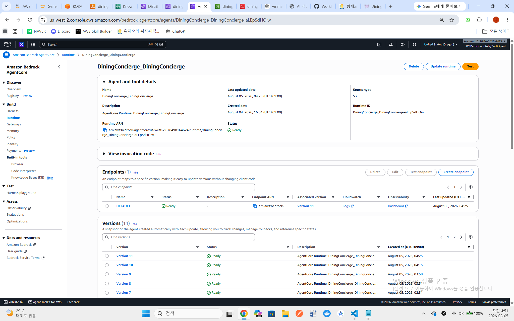 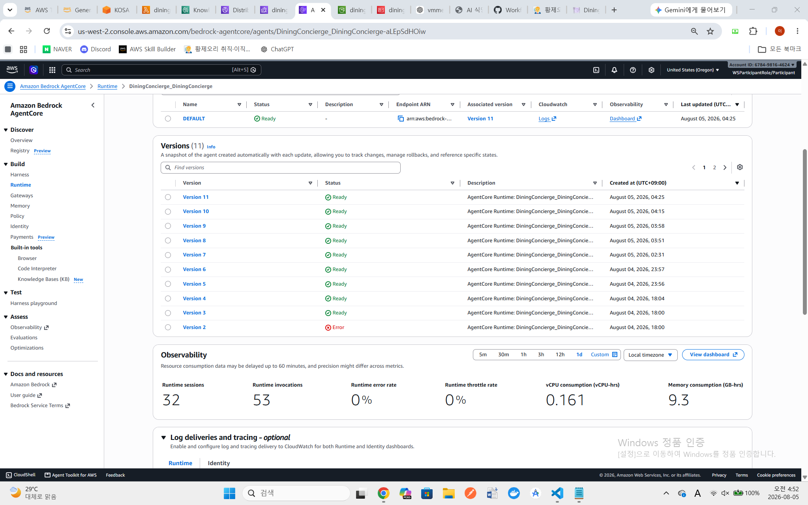

---

## STEP 4 — Memory + Web Search Gateway

### 무엇을 했나 (What)

#### 4-1. AgentCore Memory 생성

```bash
npx @aws/agentcore add memory \
  --name dining_memory \
  --strategies USER_PREFERENCE,SEMANTIC \
  --expiry 30
```

**Memory 전략:**
- `USER_PREFERENCE`: 사용자 취향 자동 추출 ("매운 거 좋아해" → `{preference: spicy}`)
- `SEMANTIC`: 대화 내용을 의미 기반으로 저장/검색

**동작 흐름:**
```
사용자: "나는 매운 음식을 좋아하고 조용한 분위기를 선호해"
  ↓
Memory Event 생성 → 취향 자동 추출
  ↓
벡터 인덱싱 (최대 10분 소요)
  ↓
다음 대화: "식당 추천해줘"
  → Memory에서 취향 검색 → "매운 음식 + 조용한 분위기" 반영하여 추천
```

#### 4-2. Web Search Gateway 생성 (us-east-1)

```bash
npx @aws/agentcore add gateway \
  --name dining-web-search \
  --protocol-type MCP \
  --authorizer-type NONE

npx @aws/agentcore add gateway-target \
  --name web-search \
  --gateway dining-web-search \
  --type connector \
  --connector web-search
```

**Web Search Gateway 동작:**
```
사용자: "강남역 근처 오늘 축제가 있나요?"
  ↓
Agent 판단: KB에 없는 실시간 정보 → Web Search 도구 선택
  ↓
Gateway (us-east-1) → MCP 프로토콜로 웹 검색 수행
  ↓
검색 결과를 Agent에게 반환 → 답변에 반영
```

> **주의**: Web Search Gateway는 **us-east-1 전용** 서비스입니다. us-west-2에서 생성하면 cross-region 호출됩니다.

#### 4-3. setup.sh에 의한 자동화

`setup.sh --agent` 실행 시:
1. Memory 존재 여부 확인 → 없으면 자동 생성 (비대화형)
2. Gateway 존재 여부 확인 → 없으면 자동 생성
3. `agentcore deploy` 실행 → Memory + Gateway + Runtime 일괄 배포
4. MEMORY_ID, GATEWAY_URL을 앱 코드에 자동 반영 (`sed`)

### 왜 필요한가 (Why)

#### Memory가 필요한 이유
- **개인화**: 매번 취향을 반복 입력하지 않아도 됨
- **대화 맥락 유지**: 세션 간에도 사용자 정보 유지
- **추천 품질 향상**: 축적된 취향 데이터로 더 정확한 추천

#### Web Search가 필요한 이유
- **KB의 한계**: KB는 정적 데이터 → 영업시간 변경, 신규 이벤트, 날씨 등 반영 불가
- **실시간 보완**: 웹 검색으로 최신 정보를 가져와 답변 보강
- **커버리지 확대**: KB에 없는 질문도 웹 검색으로 답변 가능

### 핵심 개념 설명

| 개념 | 설명 |
|------|------|
| **AgentCore Memory** | 에이전트의 장기 기억 저장소. 대화에서 정보를 추출하여 벡터로 저장 |
| **USER_PREFERENCE** | Memory 전략 — 사용자의 선호도/취향을 자동 추출하여 저장 |
| **SEMANTIC** | Memory 전략 — 대화 내용을 의미 기반으로 벡터화하여 저장. 유사 맥락 검색 가능 |
| **Event → Extraction → Indexing** | Memory 파이프라인: 대화 이벤트 → 정보 추출 → 벡터 인덱싱 (비동기, 최대 10분) |
| **Web Search Gateway** | AgentCore의 관리형 웹 검색 커넥터. MCP 프로토콜로 에이전트에 노출 |
| **Managed Connector** | Gateway에 연결하는 사전 구축된 통합. `web-search` 커넥터 = 웹 검색 기능 |
| **Cross-Region** | Web Search는 us-east-1에만 존재. us-west-2의 Runtime에서 cross-region 호출 |

### 📸 필요한 캡처

| # | 위치 | 캡처 내용 |
|---|------|-----------|
| 1 | AWS 콘솔 → AgentCore → Memory | Memory 상세 (이름, 전략 USER_PREFERENCE+SEMANTIC, 상태) | 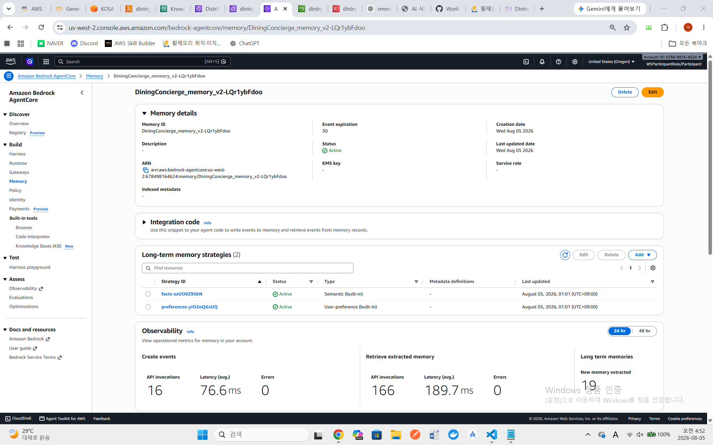
| 2 | AWS 콘솔 → AgentCore → Gateways (us-east-1 선택) | Gateway READY 상태, 프로토콜 MCP | 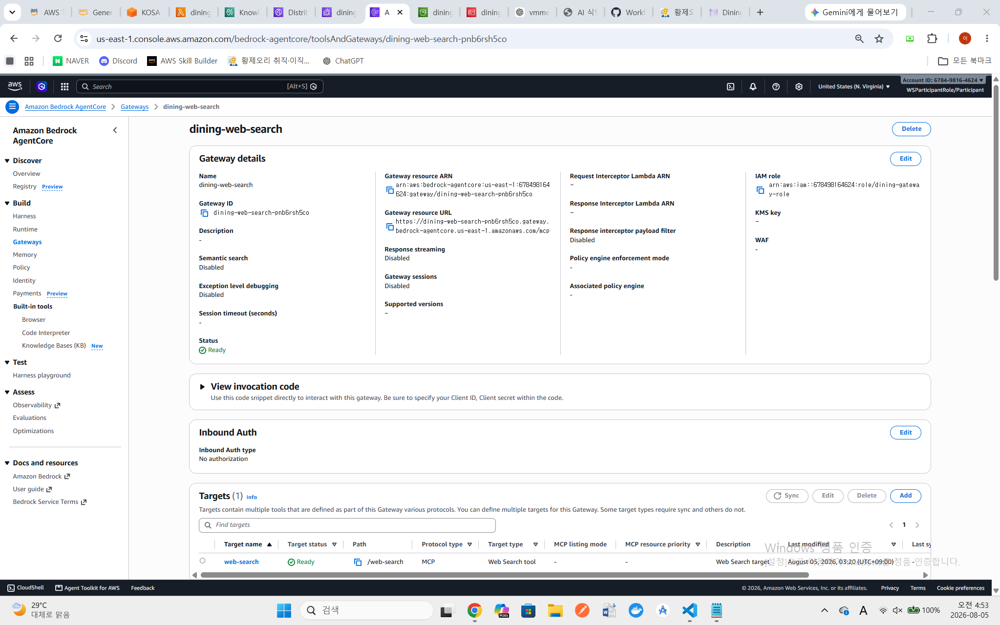
| 3 | Streamlit 앱 | 취향 입력 → 다음 대화에서 반영된 추천 (예: "매운 거 좋아해" → 이후 매운 식당 우선) | 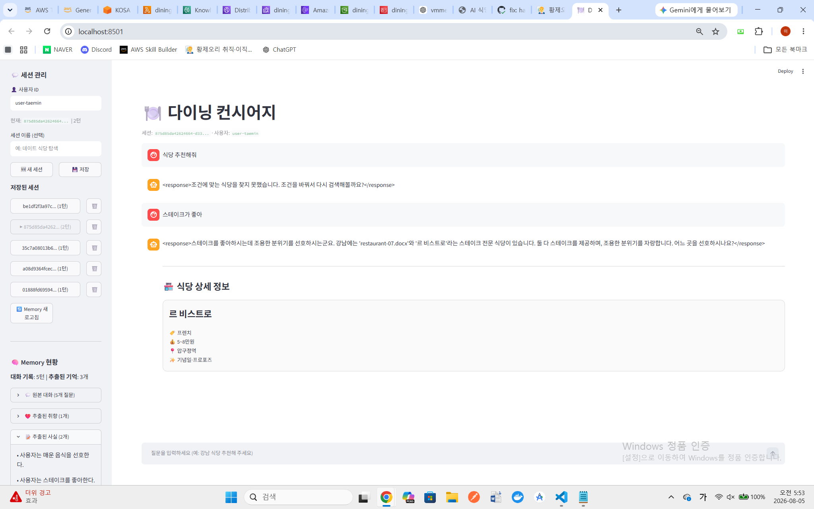 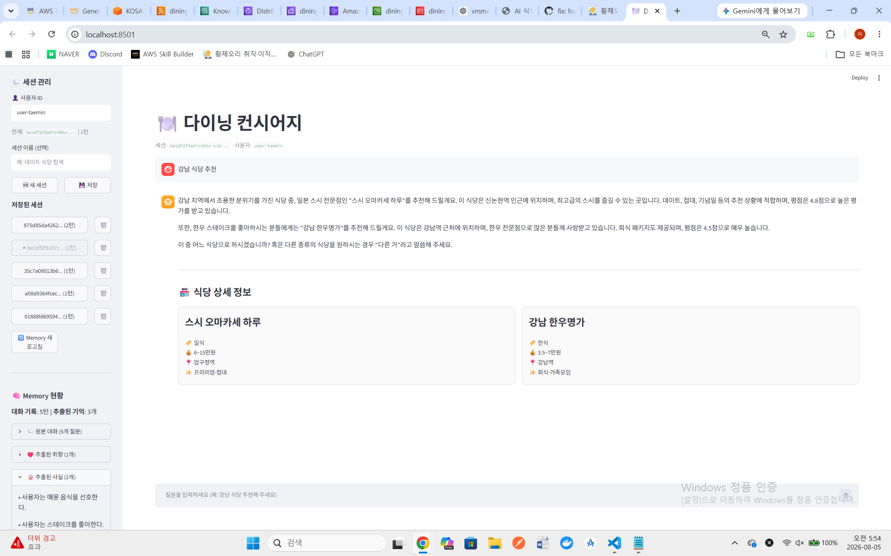 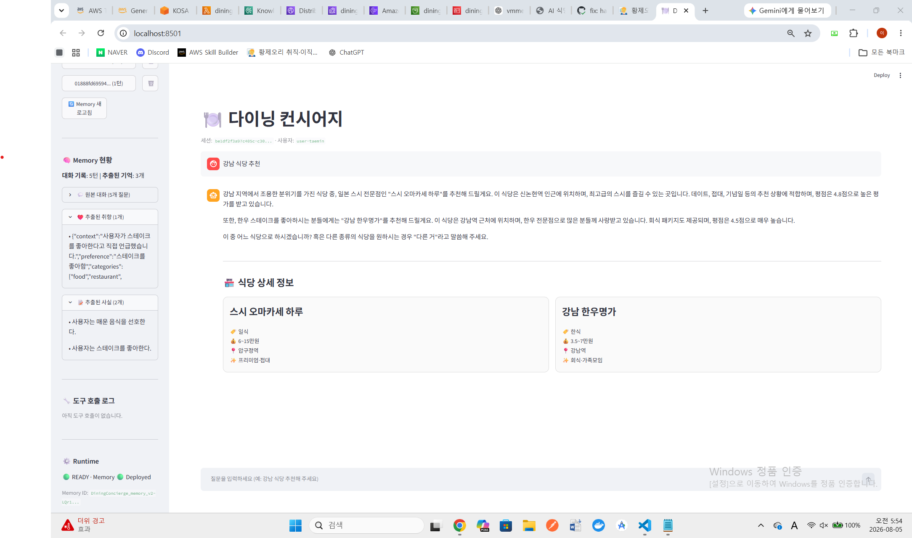
| 4 | Streamlit 앱 | 웹 검색 결과 포함 답변 (예: "강남역 주변 축제" 검색 결과) | 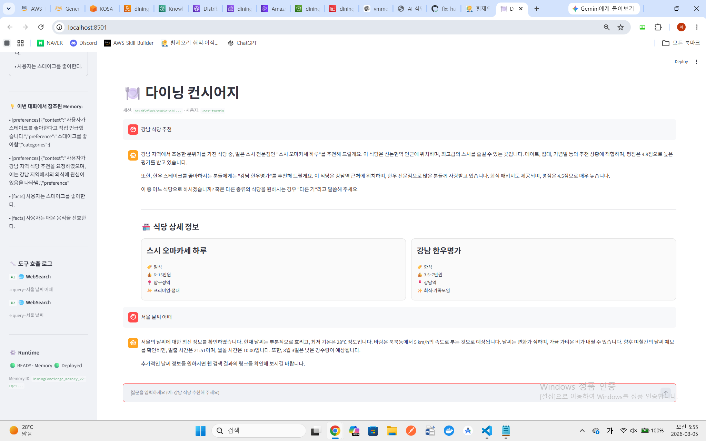

---

## STEP 5 — SAM API (서버리스 백엔드)

### 무엇을 했나 (What)

#### 5-1. SAM 템플릿 (`template.yaml`)

```yaml
# Lambda 함수 정의 — 순수 프록시
Resources:
  ChatFunction:
    Type: AWS::Serverless::Function
    Properties:
      Runtime: python3.12
      MemorySize: 256            # 경량 — boto3만 사용
      Timeout: 90                # Runtime 응답 대기
      Handler: app.lambda_handler
      Environment:
        Variables:
          RUNTIME_ARN: arn:aws:bedrock-agentcore:us-west-2:678498164624:runtime/DiningConcierge_DiningConcierge-aLEpSdHOiw
      Policies:
        - Statement:
            - Effect: Allow
              Action: bedrock-agentcore:InvokeAgentRuntime
              Resource: "*"
      Events:
        ChatPost:    # POST /chat
        ChatOptions: # OPTIONS /chat (CORS preflight)
```

#### 5-2. Lambda 코드 (`chat_function/app.py`)

```python
def lambda_handler(event, context):
    # 1. CORS preflight 처리
    if http_method == "OPTIONS":
        return build_response(200, {"message": "OK"})

    # 2. 요청 파싱
    message = body.get("message", "")

    # 3. AgentCore Runtime 호출 (핵심 — 이것만 함)
    response = agentcore_client.invoke_agent_runtime(
        agentRuntimeArn=RUNTIME_ARN,
        payload=json.dumps({"prompt": message}).encode("utf-8"),
        contentType="application/json",
        accept="application/json",
    )

    # 4. SSE 스트리밍 응답 파싱
    stream_data = response["response"].read().decode("utf-8")
    for line in stream_data.split("\n"):
        if line.startswith("data: "):
            event_data = json.loads(line[6:])
            # contentBlockDelta에서 텍스트 추출
            text = event_data.get("event", {}).get("contentBlockDelta", {}).get("delta", {}).get("text", "")
            reply_parts.append(text)

    # 5. 조합된 응답 반환
    return build_response(200, {"reply": "".join(reply_parts)})
```

#### 5-3. 배포 및 테스트

```bash
# 배포
cd 05-sam
sam build
sam deploy --stack-name dining-sam-api --no-confirm-changeset --resolve-s3

# 테스트
curl -X POST https://xxx.execute-api.us-west-2.amazonaws.com/Prod/chat \
  -H "Content-Type: application/json" \
  -d '{"message": "이탈리안 식당 추천해줘"}'
# → {"reply": "강남 지역의 이탈리안 식당을 추천드립니다! 트라토리아 강남은..."}
```

### 왜 필요한가 (Why)

**브라우저에서 AgentCore Runtime을 직접 호출할 수 없습니다.**

```
문제: 브라우저 → Runtime 직접 호출
  ✗ AWS IAM 자격증명이 필요 (Access Key, Secret Key)
  ✗ 자격증명을 브라우저에 노출하면 보안 사고

해결: Lambda를 프록시로 사용
  브라우저 → (공개 API) → Lambda → (IAM 인증) → Runtime
  ✓ 브라우저는 자격증명 불필요 (공개 API Gateway)
  ✓ Lambda는 IAM Role로 안전하게 Runtime 호출
  ✓ CORS 설정으로 프론트엔드 도메인만 허용 가능
```

**프록시 패턴의 장점:**
- Lambda에 에이전트 로직이 **전혀 없음** → 에이전트 수정 시 Lambda 재배포 불필요
- Lambda는 256MB로 경량 (boto3만 의존) → 빠른 콜드 스타트
- Runtime에 연결된 모든 기능(KB, MCP, Memory, WebSearch)을 프론트에서 그대로 사용

### 핵심 개념 설명

| 개념 | 설명 |
|------|------|
| **SAM (Serverless Application Model)** | AWS의 서버리스 IaC 도구. `template.yaml`로 Lambda + API Gateway 정의 + 배포 |
| **Lambda Proxy Pattern** | Lambda가 다른 서비스의 프록시 역할만 수행. 비즈니스 로직 없이 요청 전달 |
| **API Gateway** | HTTP API를 관리. 라우팅, 인증, 쓰로틀링, CORS 처리 |
| **invoke_agent_runtime()** | AgentCore Runtime을 호출하는 boto3 API. ARN으로 특정 Runtime 지정 |
| **StreamingBody** | boto3 응답의 스트리밍 바디. `.read()`로 전체 수신 또는 chunk 단위로 처리 |
| **SSE (Server-Sent Events)** | 서버→클라이언트 단방향 스트리밍. `data: {json}\n` 형식. Runtime 응답이 이 형태 |
| **CORS** | Cross-Origin Resource Sharing. 다른 도메인(CloudFront)에서 API 호출 허용 설정 |

### 📸 필요한 캡처

| # | 위치 | 캡처 내용 |
|---|------|-----------|
| 1 | 터미널 | `sam build && sam deploy` 실행 결과 (스택 생성 + API URL 출력) |
| 2 | 터미널 | `curl -X POST .../chat` 테스트 — 정상 응답 확인 |
| 3 | AWS 콘솔 → API Gateway | REST API 리소스 (`/chat` POST + OPTIONS) | 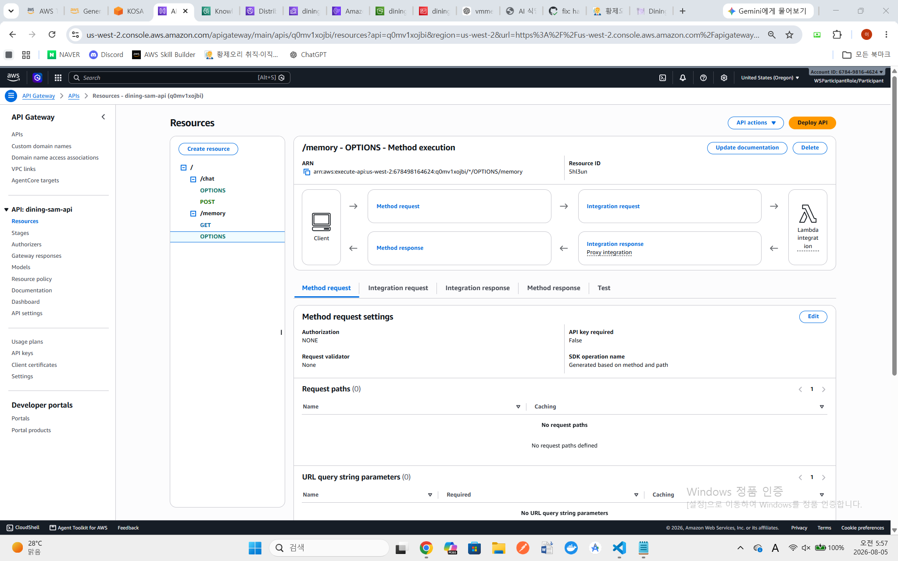
| 4 | AWS 콘솔 → Lambda | 함수 설정 (환경변수 RUNTIME_ARN, 메모리 256MB, 타임아웃 90s) | 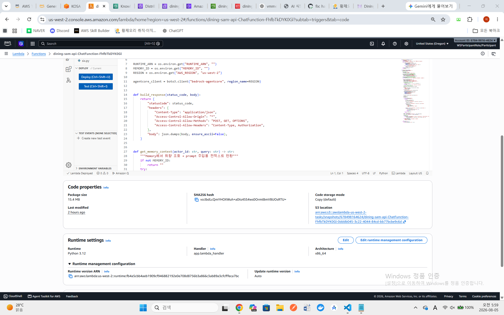

---

## STEP 6 — React 프론트엔드 + CloudFront

### 무엇을 했나 (What)

#### 6-1. React + Cloudscape 채팅 UI

```javascript
// App.js — 핵심 구조
import { ChatBubble, Avatar, LoadingBar } from '@cloudscape-design/chat-components';
import AppLayout from '@cloudscape-design/components/app-layout';

function App() {
  const sendMessage = async () => {
    // POST /chat → API Gateway → Lambda → Runtime
    const response = await fetch(`${API_URL}/chat`, {
      method: 'POST',
      body: JSON.stringify({ message: text }),
    });
    const data = await response.json();
    // ChatBubble로 렌더링
  };

  return (
    <AppLayout content={
      <Container header={<Header>AI 식당 추천 채팅</Header>}>
        {messages.map(msg => (
          <ChatBubble
            type={msg.role === 'user' ? 'outgoing' : 'incoming'}
            avatar={<Avatar color={msg.role === 'user' ? 'default' : 'gen-ai'} />}
          >
            {msg.content}
          </ChatBubble>
        ))}
        {loading && <ChatBubble showLoadingBar={true}>응답 중...</ChatBubble>}
      </Container>
    } />
  );
}
```

**UI 특징:**
- `ChatBubble`: 사용자(outgoing, 오른쪽) / AI(incoming, 왼쪽) 구분
- `Avatar`: 사용자(person icon) / AI(gen-ai icon, 보라색)
- `LoadingBar`: 응답 대기 중 애니메이션
- 반응형 레이아웃 + 자동 스크롤
- 접근성(a11y) 기본 지원 (aria-label, 키보드 네비게이션)

#### 6-2. CloudFront + S3 호스팅

```bash
# setup.sh --frontend 내부 동작:

# 1. React 빌드 (API URL 주입)
REACT_APP_API_URL=$(cat 05-sam/api-url.txt)
npm run build

# 2. S3에 업로드
aws s3 sync build/ s3://dining-frontend-678498164624/ --delete

# 3. OAC 생성 (Origin Access Control)
aws cloudfront create-origin-access-control \
  --origin-access-control-config '{
    "Name": "dining-frontend-oac",
    "OriginAccessControlOriginType": "s3",
    "SigningBehavior": "always",
    "SigningProtocol": "sigv4"
  }'

# 4. CloudFront Distribution 생성
aws cloudfront create-distribution \
  --distribution-config '{
    "DefaultRootObject": "index.html",
    "CustomErrorResponses": [
      {"ErrorCode": 403, "ResponsePagePath": "/index.html", "ResponseCode": "200"},
      {"ErrorCode": 404, "ResponsePagePath": "/index.html", "ResponseCode": "200"}
    ],
    "DefaultCacheBehavior": {
      "ViewerProtocolPolicy": "redirect-to-https",
      "CachePolicyId": "658327ea-f89d-4fab-a63d-7e88639e58f6",  # CachingOptimized
      "Compress": true
    },
    "PriceClass": "PriceClass_100"
  }'

# 5. S3 버킷 정책 설정 (CloudFront만 접근 허용)
aws s3api put-bucket-policy --bucket dining-frontend-678498164624 --policy '{
  "Statement": [{
    "Principal": {"Service": "cloudfront.amazonaws.com"},
    "Action": "s3:GetObject",
    "Condition": {"StringEquals": {"AWS:SourceArn": "arn:aws:cloudfront::678498164624:distribution/XXXXXX"}}
  }]
}'
```

#### 6-3. SPA 라우팅 처리

CloudFront `CustomErrorResponses`에서 403/404를 `/index.html`로 리다이렉트:
- S3에는 `/chat`, `/about` 같은 경로의 파일이 없음
- CloudFront가 403/404 수신 → `index.html` 반환 → React Router가 클라이언트에서 라우팅

### 왜 필요한가 (Why)

**사용자가 직접 접근하는 최종 인터페이스입니다.**

- **CloudFront (CDN)**: 전 세계 엣지에서 캐시 → 빠른 응답 + HTTPS 자동
- **OAC**: S3 버킷을 퍼블릭으로 열지 않아도 CloudFront를 통해서만 접근 (보안)
- **Cloudscape**: AWS 콘솔과 동일한 디자인 시스템 → 전문적인 UI + 접근성 기본 제공
- **SPA**: 단일 HTML로 모든 라우팅 처리 → 새로고침 시에도 정상 동작

### 핵심 개념 설명

| 개념 | 설명 |
|------|------|
| **Cloudscape Design System** | AWS의 공식 UI 프레임워크. React 컴포넌트 라이브러리. AWS 콘솔과 동일한 UX |
| **ChatBubble / Avatar** | Cloudscape Chat 컴포넌트. 메시지 버블 + 아바타 (사용자/AI 구분) |
| **OAC (Origin Access Control)** | CloudFront → S3 접근 제어. S3를 퍼블릭으로 열지 않고 CloudFront만 허용 |
| **SPA Routing** | Single Page Application. 모든 경로를 index.html이 처리. 403/404→200 리다이렉트 |
| **Cache Invalidation** | CloudFront 엣지 캐시 무효화. 배포 후 `/*` 무효화로 새 버전 즉시 반영 |
| **PriceClass_100** | CloudFront 가격 등급. 북미+유럽+아시아 엣지만 사용 (비용 절감) |

### 📸 필요한 캡처

| # | 위치 | 캡처 내용 |
|---|------|-----------|
| 1 | 브라우저 | CloudFront URL 접속 → 채팅 초기 화면 ("메시지를 입력해주세요") | 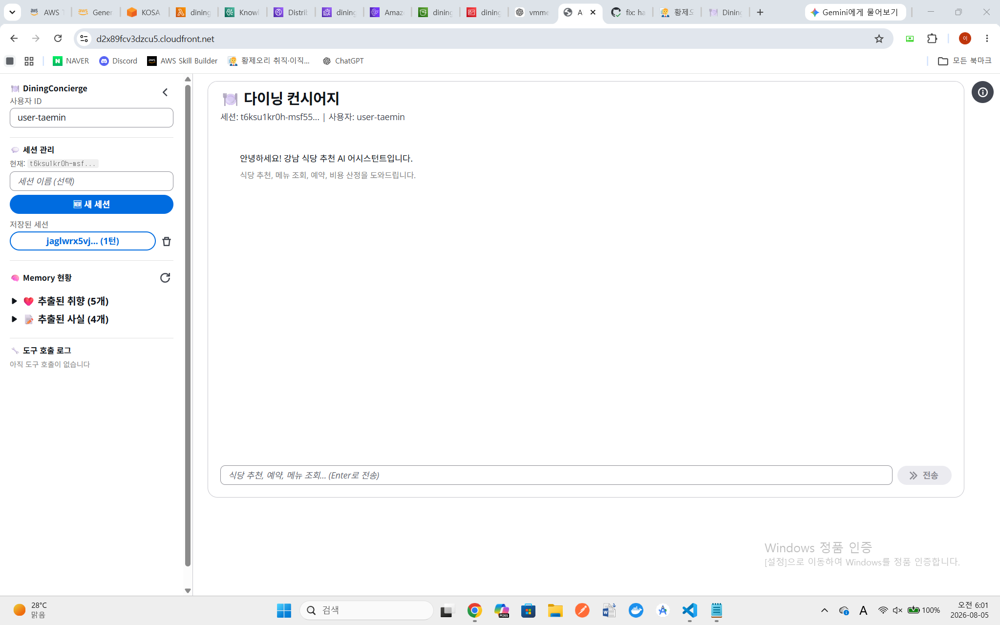
| 2 | 브라우저 | 대화 진행 중 — 사용자 메시지(오른쪽) + AI 응답(왼쪽) | 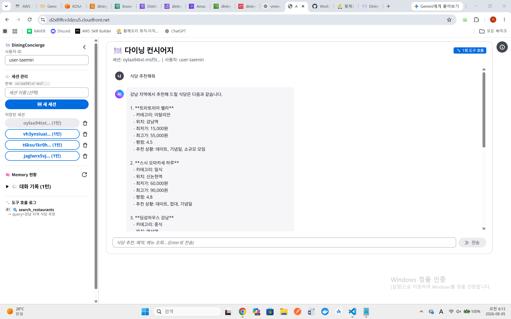
| 3 | 브라우저 | 로딩 인디케이터 표시 상태 (보라색 AI 아바타 + "응답 중...") | 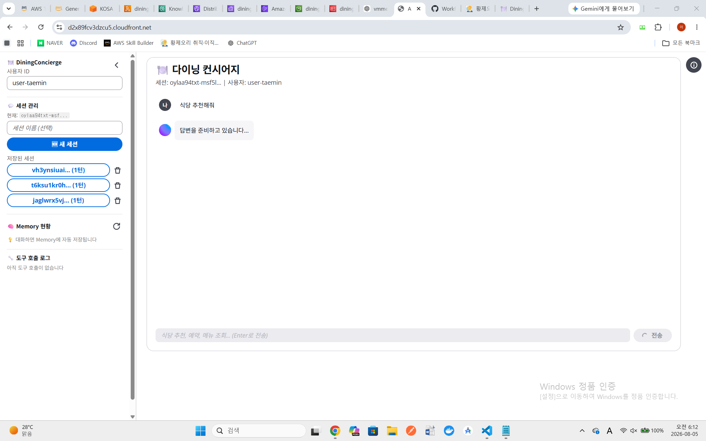
| 4 | AWS 콘솔 → CloudFront | Distribution 상태 (Enabled, Domain: d2x89fcv3dzcu5.cloudfront.net) | 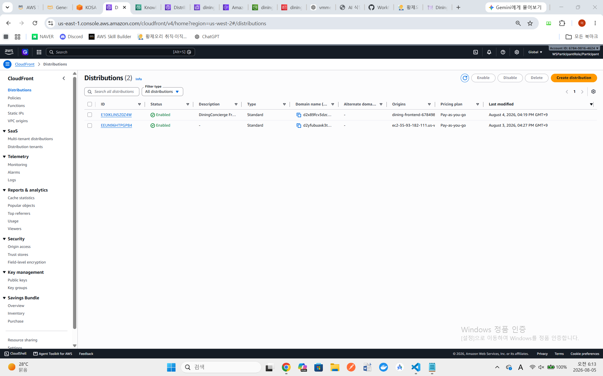
| 5 | AWS 콘솔 → S3 → `dining-frontend-678498164624` | 빌드 파일 목록 (index.html, static/js, static/css) | 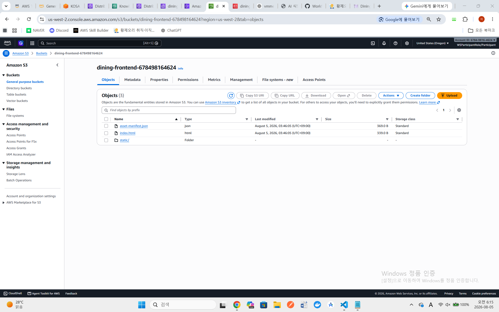
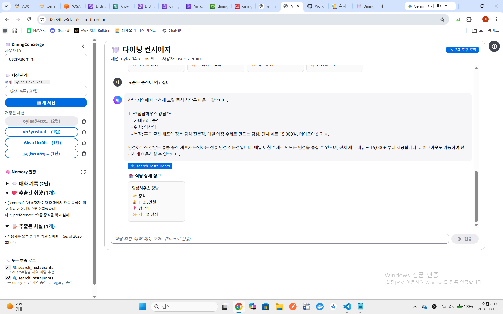 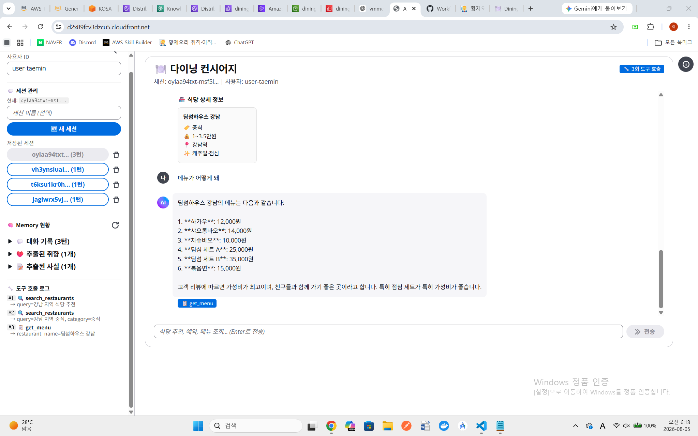 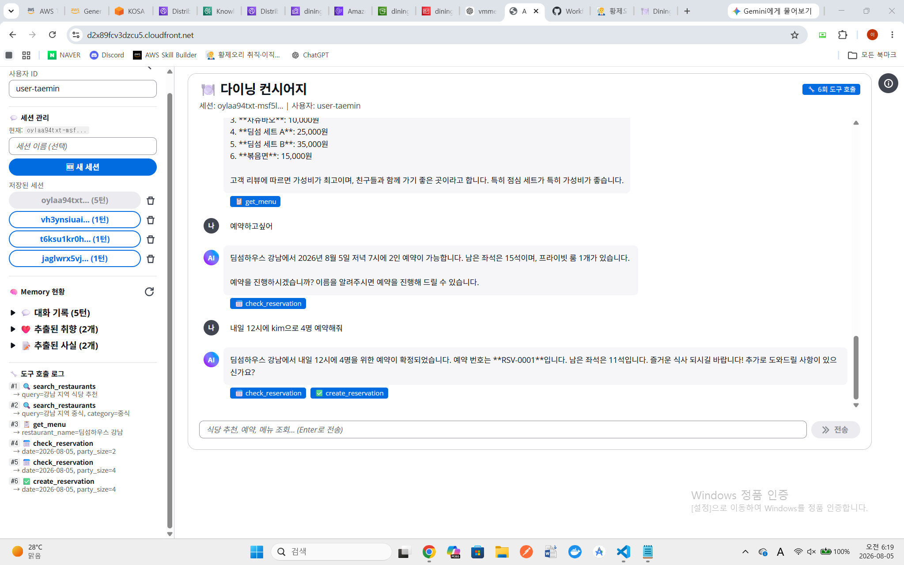
---

## STEP 7 — CI/CD (GitHub Actions)

### 무엇을 했나 (What)

#### 7-1. 워크플로우 3개 (경로 필터 기반)

| 파일 | 트리거 경로 | 파이프라인 단계 |
|------|------------|----------------|
| `agent.yml` | `02-agent/**`, `04-pipeline/**` | Strands Evals 평가 → (PASS) → CDK bootstrap → AgentCore deploy |
| `api.yml` | `05-sam/**` | SAM build → SAM deploy |
| `frontend.yml` | `06-frontend/**` | Get API URL → npm build → S3 sync → CloudFront 무효화 |

```yaml
# agent.yml — 경로 필터 예시
on:
  push:
    branches: [main]
    paths:
      - '02-agent/**'      # 에이전트 코드 변경 시에만
      - '04-pipeline/**'   # 평가 코드 변경 시에도
```

#### 7-2. Strands Evals 평가 게이트 (`eval_gate.py`)

에이전트 배포 전 **품질 검증**을 통과해야만 프로덕션에 배포됩니다:

```python
# 3개 테스트 케이스 정의
experiments = [
    {
        "name": "이탈리안 식당 추천",
        "case": Case(input="이탈리안 식당 추천해줘"),
        "evaluators": [
            ToolCalled(tool_name="search_restaurants"),  # 도구 호출 검증
            Contains(value="트라토리아"),                 # 응답 내용 검증
        ],
    },
    {
        "name": "메뉴 조회",
        "case": Case(input="서울갈비 강남본점 메뉴 알려줘"),
        "evaluators": [
            ToolCalled(tool_name="get_menu"),
            Contains(value="갈비"),
        ],
    },
    {
        "name": "조용한 일식당 추천",
        "case": Case(input="조용한 분위기의 일식당 추천해줘"),
        "evaluators": [
            ToolCalled(tool_name="search_restaurants"),
            Contains(value="오마카세"),
        ],
    },
]

# 평균 점수 계산 → 0.7 이상이면 PASS
avg_score = sum(all_scores) / len(all_scores)
if avg_score >= 0.7:
    sys.exit(0)   # PASS → deploy job 실행
else:
    sys.exit(1)   # FAIL → 배포 차단
```

**평가 기준:**
- `ToolCalled`: 에이전트가 올바른 도구를 호출했는지 (도구 선택 능력)
- `Contains`: 응답에 기대 키워드가 포함되었는지 (답변 품질)
- 각 evaluator 0~1점, 케이스별 평균 → 전체 평균 ≥ 0.7 시 PASS

#### 7-3. AgentCore Deploy (CI에서의 특이사항)

```yaml
# agent.yml deploy job
- name: Install uv (Python package manager)
  run: curl -LsSf https://astral.sh/uv/install.sh | sh
  # → CodeZip 빌드 시 aarch64 크로스 컴파일에 uv 필요

- name: CDK Bootstrap
  run: npx cdk bootstrap aws://${ACCOUNT_ID}/us-west-2
  # → 첫 배포 시 CDK가 사용하는 S3 버킷 + IAM 역할 생성

- name: Deploy to AgentCore Runtime
  run: npx @aws/agentcore deploy --yes --verbose
```

#### 7-4. 무중단 배포 전략 (Zero-Downtime)

모든 계층이 blue-green 방식으로 동작하여 **배포 중에도 서비스 정상 유지**:

```
┌─────────────────────────────────────────────────────────────┐
│ AgentCore Runtime                                           │
│  현재 v1 서빙 중 → v2 코드 업로드 + 준비(CREATING)          │
│  → v2 READY 확인 → 트래픽을 v2로 전환                       │
│  → 배포 중 v1이 계속 응답 (다운타임 0)                       │
├─────────────────────────────────────────────────────────────┤
│ Lambda (SAM)                                                 │
│  새 코드 업로드 → 다음 호출부터 새 버전 적용                  │
│  → 진행 중인 요청은 이전 버전으로 완료 (다운타임 0)           │
├─────────────────────────────────────────────────────────────┤
│ CloudFront + S3                                              │
│  새 파일 S3 업로드 → 캐시 무효화(/*) → 엣지에서 새 파일 서빙  │
│  → 무효화 전까지 이전 버전 서빙 (다운타임 0)                  │
└─────────────────────────────────────────────────────────────┘
```

### 왜 필요한가 (Why)

**수동 배포는 실수가 발생하고, 품질 저하를 방지할 수 없습니다.**

- **자동화**: `git push`만으로 변경된 부분 자동 배포 → 수동 실수 제거
- **평가 게이트**: 에이전트 품질이 기준 이하면 배포 차단 → 프로덕션 보호
- **독립 파이프라인**: 프론트엔드만 수정해도 에이전트가 재배포되지 않음 (경로 필터)
- **무중단**: 사용자는 배포를 인지하지 못함 (blue-green)

### 핵심 개념 설명

| 개념 | 설명 |
|------|------|
| **GitHub Actions Path Filters** | `paths:` 설정으로 특정 경로 변경 시에만 워크플로우 실행. 모노레포에 필수 |
| **Strands Evals** | Strands SDK의 평가 프레임워크. `Case` + `Evaluator` 조합으로 에이전트 품질 측정 |
| **ToolCalled Evaluator** | 에이전트 trajectory에서 특정 도구 호출 여부 확인. 0(미호출) or 1(호출) |
| **Contains Evaluator** | 에이전트 응답에 특정 문자열 포함 여부 확인. 0(미포함) or 1(포함) |
| **Evaluation Gate** | 평가 통과 시에만 다음 단계(배포) 진행. CI/CD의 품질 관문 |
| **Blue-Green Deployment** | 새 버전을 별도 환경에 준비 후 트래픽 전환. 롤백도 즉시 가능 |
| **uv Cross-Compilation** | GitHub Actions(x86_64)에서 Runtime(aarch64)용 패키지 빌드 시 uv가 크로스 컴파일 |
| **CDK Bootstrap** | CDK가 사용하는 S3/IAM을 계정에 최초 1회 생성. `cdk bootstrap aws://ACCOUNT/REGION` |

### 📸 필요한 캡처

| # | 위치 | 캡처 내용 |
|---|------|-----------|
| 1 | GitHub → Actions 탭 | 3개 워크플로우 목록 (agent, api, frontend) | 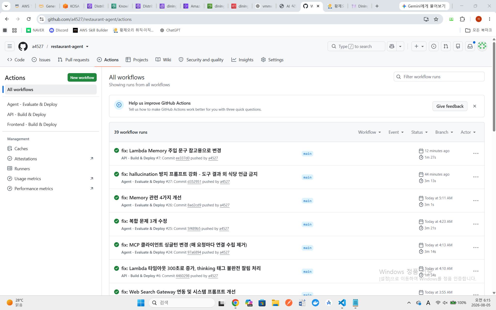
| 2 | GitHub → Actions → agent.yml 실행 | `evaluate` → `deploy` 2단계 통과 화면 |
| 3 | GitHub → Actions → frontend.yml 실행 | build → S3 sync → CloudFront invalidation 통과 |
| 4 | GitHub → repo Settings → Secrets | AWS_ACCESS_KEY_ID, AWS_SECRET_ACCESS_KEY, AWS_SESSION_TOKEN 등록 |
| 5 | 터미널 | `git push origin main` 후 워크플로우 자동 트리거 확인 |

---

## STEP 8 — 전체 자동화 (`setup.sh --all`)

### 무엇을 했나 (What)

#### 8-1. 원커맨드 재현 스크립트

```bash
cd restaurant-project
./setup.sh --all
# → 새 AWS 계정에서 15~25분 만에 전체 인프라 + 앱 재현 완료
```

**단계별 실행 흐름:**

| 단계 | 옵션 | 수행 내용 | 소요 시간 |
|------|------|-----------|-----------|
| STEP 0 | `--infra` | CloudFormation (S3 ×2 + IAM ×2) | ~2분 |
| STEP 1 | `--kb` | OpenSearch → 인덱스 → KB → 데이터 동기화 | ~12분 |
| STEP 2 | `--agent` | Memory + Gateway + AgentCore Runtime 배포 | ~5분 |
| STEP 3 | `--app` | Streamlit venv 구성 (선택) | ~1분 |
| STEP 4 | `--sam` | SAM build + deploy | ~3분 |
| STEP 5 | `--frontend` | npm build + S3 + CloudFront 생성 | ~3분 |
| STEP 6 | `--pipeline` | GitHub Actions 설정 안내 | 즉시 |

#### 8-2. 자동화 이전 vs 이후

| 항목 | 이전 (수동) | 현재 (자동화) |
|------|------------|--------------|
| OpenSearch 컬렉션 | 콘솔에서 수동 생성, 정책 3개 수동 설정 | 스크립트가 정책 생성 + 컬렉션 생성 + ACTIVE 대기 |
| KB_ID → 코드 반영 | 콘솔에서 KB_ID 복사 → `tools.py`에 수동 붙여넣기 | `kb-id.txt` 저장 → `sed`로 자동 반영 |
| RUNTIME_ARN → Lambda | `agentcore status`에서 ARN 복사 → `template.yaml` 수동 수정 | `agentcore status` 파싱 → 자동 반영 |
| MEMORY_ID → 앱 코드 | 콘솔에서 Memory ID 복사 → `app.py` 수동 수정 | `agentcore status` 파싱 → 자동 반영 |
| GATEWAY_URL → 앱 코드 | Gateway 콘솔에서 URL 확인 → 수동 복사 | `agentcore status` 파싱 → 자동 반영 |
| Memory 생성 | `agentcore add memory` 대화형 CLI (입력 대기) | `--name --strategies` 플래그로 비대화형 실행 |
| Web Search Gateway | AWS 콘솔에서 수동 생성 + Connector 연결 | `agentcore add gateway` + `add gateway-target` 자동 |
| CloudFront | 콘솔에서 수동 생성, OAC/버킷정책 수동 | CLI로 OAC + Distribution + 버킷정책 일괄 생성 |
| CI/CD 인프라 | CodePipeline + CodeBuild (AWS 리소스 필요) | GitHub Actions (추가 AWS 리소스 불필요) |

#### 8-3. 멱등성(Idempotency) 보장

```bash
# 여러 번 실행해도 안전
./setup.sh --all  # 1회차: 전체 생성
./setup.sh --all  # 2회차: "이미 존재 — 건너뜀" 출력 후 정상 완료

# 내부 멱등성 로직:
EXISTING_COLLECTION=$(aws opensearchserverless list-collections ...)
if [ -n "$EXISTING_COLLECTION" ]; then
    echo "기존 컬렉션 발견: $COLLECTION_ID (재사용)"  # ← 재생성 안 함
else
    aws opensearchserverless create-collection ...     # ← 없을 때만 생성
fi
```

모든 리소스(Collection, KB, Memory, Gateway, CloudFront)에 대해:
1. 존재 여부 확인 (list/describe API)
2. 있으면 기존 ID 재사용
3. 없으면 새로 생성

#### 8-4. ID/ARN 자동 전파 체인

```
setup-kb.sh → kb-id.txt (LOAIJ2HJXE)
  ↓ sed
tools.py (KB_ID = "LOAIJ2HJXE")

agentcore deploy → agentcore status → RUNTIME_ARN 파싱
  ↓ sed
template.yaml (RUNTIME_ARN: arn:aws:bedrock-agentcore:...) → sam deploy → Lambda 환경변수
  ↓ sed
app.py (RUNTIME_ARN = "...")

agentcore status → MEMORY_ID, GATEWAY_URL 파싱
  ↓ sed
app.py (MEMORY_ID, GATEWAY_WEB_SEARCH_URL)

sam deploy → CloudFormation Outputs → API_URL
  ↓ 환경변수
REACT_APP_API_URL → npm run build → 프론트엔드에 번들
```

### 왜 필요한가 (Why)

**재현성, 온보딩, 유지보수의 세 가지 목적:**

1. **재현성**: 워크샵이나 데모에서 다른 AWS 계정으로 즉시 재현 가능
   - "이 프로젝트를 다른 팀에서 해보고 싶은데요" → `./setup.sh --all` 한 번이면 됩니다
   
2. **온보딩**: 새 팀원이 환경 구축에 반나절 대신 15분 소요
   - 수동 설정 0개, 콘솔 접근 불필요

3. **IaC (Infrastructure as Code)**: 인프라를 코드로 관리
   - 버전 관리 가능, 변경 이력 추적, 리뷰 가능
   - "어떤 설정을 왜 했는지"가 스크립트에 기록됨

### 📸 필요한 캡처

| # | 위치 | 캡처 내용 |
|---|------|-----------|
| 1 | 터미널 | `./setup.sh --all` 실행 전체 로그 (STEP 0~6 순차 출력) |
| 2 | 터미널 | 최종 "✅ 설정 완료!" 메시지 + 실행 방법 안내 |
| 3 | 브라우저 | CloudFront URL에서 정상 동작하는 채팅 화면 (질문 → 응답) |

---

## 현재 리소스 현황

> 계정: `678498164624` | 리전: `us-west-2` (Gateway만 `us-east-1`)

| 리소스 | ID / 이름 | 리전 | 상태 |
|--------|-----------|------|------|
| S3 (KB data) | `dining-kb-data-678498164624` | us-west-2 | Active |
| S3 (Frontend) | `dining-frontend-678498164624` | us-west-2 | Active |
| OpenSearch Serverless | `dining-kb-collection` (`wcuhxgd2o1syxk3axwnb`) | us-west-2 | ACTIVE |
| Knowledge Base | `LOAIJ2HJXE` (`dining-restaurants-kb`) | us-west-2 | Active |
| AgentCore Runtime | `DiningConcierge_DiningConcierge-aLEpSdHOiw` | us-west-2 | READY |
| Memory | `DiningConcierge_dining_memory` | us-west-2 | Active |
| Web Search Gateway | `dining-web-search` | us-east-1 | READY |
| SAM Stack | `dining-sam-api` (Lambda + API Gateway) | us-west-2 | Active |
| CloudFront | `d2x89fcv3dzcu5.cloudfront.net` | Global | Enabled |
| IAM 역할 | `dining-kb-role` | Global | Active |
| IAM 역할 | `dining-gateway-role` | Global | Active |
| CloudFormation Stack | `dining-infra` | us-west-2 | CREATE_COMPLETE |

---

## 기술 스택 요약

| 분류 | 기술 | 역할 |
|------|------|------|
| LLM | Amazon Nova Lite (`us.amazon.nova-lite-v1:0`) | 자연어 이해 + 응답 생성 |
| 임베딩 | Amazon Titan Embed V2 (1024차원) | 텍스트 → 벡터 변환 |
| 벡터 DB | OpenSearch Serverless (VECTORSEARCH, HNSW/FAISS) | 벡터 유사도 검색 |
| RAG | Bedrock Knowledge Base | S3 → 청킹 → 임베딩 → 검색 파이프라인 |
| 에이전트 | Strands Agents SDK + `@tool` 데코레이터 | 도구 자동 선택 + 오케스트레이션 |
| 도구 프로토콜 | MCP (Model Context Protocol, stdio) | 예약/비용 도구를 별도 서버로 분리 |
| 런타임 | Bedrock AgentCore Runtime (CodeZip, Python 3.14) | 관리형 에이전트 서빙 + 자동 스케일링 |
| 메모리 | AgentCore Memory (USER_PREFERENCE + SEMANTIC) | 사용자 취향 기억 + 개인화 |
| 웹 검색 | AgentCore Web Search Gateway (us-east-1, MCP) | 실시간 웹 정보 보완 |
| 백엔드 | Lambda Python 3.12 (256MB) + API Gateway REST | Runtime 프록시 (boto3만 사용) |
| 프론트엔드 | React 18 + Cloudscape Design System (ChatBubble) | 채팅 UI + 접근성 |
| 호스팅 | CloudFront + S3 (OAC, PriceClass_100) | CDN + HTTPS + SPA 라우팅 |
| CI/CD | GitHub Actions (경로 필터 + Strands Evals 게이트) | 자동 배포 + 품질 관문 |
| IaC | CloudFormation + AgentCore CDK + SAM | 인프라 코드 관리 |

---

## 설계 원칙 요약

| 원칙 | 적용 |
|------|------|
| **관심사 분리** | Lambda는 프록시만, 에이전트 로직은 Runtime에만 존재 |
| **독립 배포** | 에이전트/API/프론트 각각 독립적으로 배포 가능 |
| **무중단 배포** | 모든 레이어 blue-green. 사용자는 배포를 인지하지 못함 |
| **멱등성** | `setup.sh` 여러 번 실행해도 안전. 기존 리소스 재사용 |
| **자동 전파** | ID/ARN/URL이 단계 간 자동 반영. 수동 복붙 0개 |
| **품질 게이트** | 평가 미통과 시 배포 차단. 프로덕션 보호 |
| **추측 금지** | 에이전트 시스템 프롬프트에서 도구 호출 없이 식당명 추측 금지 |

---

## 현재 상태 & 다음 단계

### 프로덕션 배포 현황

| 환경 | 기능 | 상태 |
|------|------|------|
| **프로덕션** (CloudFront → Lambda → Runtime) | KB 검색 + MCP(예약/비용) + Memory + Web Search 풀기능 | ✅ 배포 중 (CI/CD) |
| **로컬** (Streamlit, `03-app/`) | KB + MCP(예약/비용) + Memory + Web Search 풀기능 | ✅ 동작 |

> 2026-08-05: Runtime main.py에 MCP/Memory/Web Search 이관 완료. GitHub Actions CI/CD로 배포 진행 중.

### 최근 변경 사항 (2026-08-05)

| 파일 | 변경 내용 |
|------|-----------|
| `02-agent/main.py` | MCP stdio(예약/비용) + Web Search Gateway + Memory 취향조회/저장 + 대화 컨텍스트 추가 |
| `02-agent/mcp_server.py` | 03-app에서 이관 (check_reservation, create_reservation, estimate_cost) |
| `02-agent/pyproject.toml` | mcp>=1.24.0 의존성 추가 |
| `02-agent/agentcore.json` | Memory/Gateway CDK 관리 제거 (별도 CLI로 관리) |
| `04-pipeline/eval_gate.py` | MCP 케이스(예약/비용) 추가 + MCP 클라이언트 연결 |
| `05-sam/chat_function/app.py` | Memory 취향 조회 → prompt 주입, /memory GET 엔드포인트, session_id/actor_id/tool_calls 반환 |
| `05-sam/template.yaml` | RUNTIME_ARN/MEMORY_ID Parameter 추가, /memory 라우트, RetrieveMemoryRecords 권한 |
| `06-frontend/src/App.js` | 다중 세션(localStorage), 도구 호출 로그, Memory 현황(추출된 취향/사실), 식당 카드, Memory 새로고침 |
| `03-app/app.py` | .env 기반으로 변경, memoryRecordSummaries 키 수정, 다중 세션, 중복 저장 방지, 대화 컨텍스트 주입 |
| `03-app/.env.example` | 환경변수 템플릿 파일 신규 생성 |
| `03-app/requirements.txt` | python-dotenv 추가 |
| `.github/workflows/agent.yml` | Memory/Gateway CLI 자동 생성(멱등), 배포 후 ARN/ID를 AWS CLI로 정확히 추출하여 SSM 저장 |
| `.github/workflows/api.yml` | SSM에서 RUNTIME_ARN/MEMORY_ID 읽어서 SAM 배포 시 주입, API_URL SSM 저장 |
| `.github/workflows/frontend.yml` | SSM에서 API_URL 읽어서 빌드 시 주입 |
| `setup.sh` | sed 방식 제거 → SSM 저장 + .env 생성으로 교체 |
| `.gitignore` | .env 추가 |
| `TROUBLESHOOTING.md` | Memory API 응답 키 변경 이슈, runtimeSessionId 33자 이슈, RUNTIME_ARN 잘림 이슈 추가 |

### 주요 버그 수정 (2026-08-05)

| 이슈 | 원인 | 해결 |
|------|------|------|
| 응답 생성 못함 | `runtimeSessionId` 최소 33자 미충족 | Frontend generateSessionId() + Lambda 패딩 처리 |
| 응답 생성 못함 | SSM 저장 시 RUNTIME_ARN 문자열 잘림 | grep 파싱 → AWS CLI 직접 조회로 변경 |
| Memory 취향 반영 안 됨 | Lambda에 MEMORY_ID 없음 + Memory 조회 로직 없음 | Lambda에 Memory 조회 추가, 환경변수 주입 |
| Memory retrieve 0건 | API 응답 키 `memoryRecords` → `memoryRecordSummaries` 변경 | 전체 코드 키 수정 |
| CDK 배포 실패 | agentcore.json의 Memory/Gateway CDK 관리 충돌 | CDK에서 제거, CLI로 별도 관리 |
| Web Search 응답 없음 | 도구 이름 `web-search___WebSearch`의 `___`로 modelStreamErrorException | `@tool`로 래핑하여 `WebSearch`로 단순화 |
| Web Search 강남 날씨 안 나옴 | 검색 엔진이 "강남" 쿼리를 강남구로 매핑 못 함 | "서울 강남구" 또는 영문 쿼리 사용 권장 |
| MCP 연결 오버헤드 | 매 요청마다 MCPClient start/stop | 싱글턴으로 변경 (앱 시작 시 1회 초기화) |
| Runtime Memory/Gateway 미적용 | 환경변수 미주입 | 환경변수 없으면 SSM에서 자동 조회하도록 변경 |

### 다음 단계

| 순서 | 작업 | 설명 |
|------|------|------|
| 1 | Gateway 보안 강화 | 현재 `authorizer-type: NONE` → `AWS_IAM`으로 전환 |
| 2 | eval 임계값 최적화 | `test_eval_threshold.py` 실행하여 배포 기준점 검증 |
| 3 | MCP 예약 데이터 영속화 | mcp_server.py 예약 데이터를 DynamoDB 등으로 저장 |

---

## 임계값 최적화 테스트

### Memory 중복 감지 임계값 (`03-app/test_memory_threshold.py`)

취향 저장 시 중복 여부를 판단하는 임계값(0.0~1.0)을 최적화합니다.

**동작 방식:**
- Titan Embed V2로 텍스트 임베딩 직접 계산 (Memory에 저장 안 함)
- 중복 쌍(8개) / 다른 내용 쌍(8개) = 총 16개 케이스
- 임계값별 정확도(accuracy), F1 스코어 계산
- 오탐(다른 내용인데 중복 판단) / 누락(중복인데 통과) 수 표시

```bash
cd ~/restaurant-project/03-app
python3 test_memory_threshold.py
```

**출력 예시:**
```
임계값 | 정확도 | 중복감지 | 다름통과 | 오탐(FP) | 누락(FN)
  0.80  |  93.8% |    87.5% |   100.0% |        0 |        1  ★
  0.85  |  87.5% |   100.0% |    75.0% |        2 |        0
```

**결과 반영:** 추천 임계값을 `app.py`의 중복 감지 기준(`score >= 0.85`)에 적용

**실측 결과 (2026-08-05)**:
| 중복 쌍 | score |
|---------|-------|
| '일식 좋아해' ↔ '일식을 좋아합니다' | 0.9442 |
| '매운 음식 못 먹어' ↔ '매운 음식은 못 먹습니다' | 0.9261 |
| '해산물 알레르기 있어' ↔ '해산물 알레르기가 있습니다' | 0.8553 |
| '매운 음식 못 먹어' ↔ '매운 거 못 먹어요' | 0.8780 |
| '와인 즐겨 마셔' ↔ '와인을 좋아해요' | 0.6354 |
| '조용한 분위기 선호해' ↔ '조용한 곳을 좋아해' | 0.6299 |
| '스테이크 좋아해' ↔ '스테이크를 즐겨 먹어요' | 0.6009 |
| '일식 좋아해' ↔ '일식을 즐겨 먹어' | 0.7519 |

다른 내용 최대 score: **0.2639** (오탐 위험 없음)

→ **임계값 0.60 적용** (누락 0건, 오탐 0건, 정확도 100%)

---

### eval 배포 임계값 (`04-pipeline/test_eval_threshold.py`)

에이전트 배포 시 최소 점수 기준(현재 0.7)이 적절한지 검증합니다.

**동작 방식:**
- 현재 eval_gate.py의 5개 케이스를 N회 반복 실행
- 점수 분포(평균, 표준편차, 최소/최대) 계산
- 임계값별 PASS율 계산 → 90% 이상 통과하는 최저 임계값 추천

```bash
cd ~/restaurant-project/04-pipeline
python3 test_eval_threshold.py           # 3회 반복 (기본)
python3 test_eval_threshold.py --runs 5  # 5회 반복
```

**출력 예시:**
```
임계값 | PASS율  | PASS횟수 | 판단
  0.60  |  100.0% |   3/3    | ✅ 항상 통과
  0.70  |  100.0% |   3/3    | ✅ 항상 통과  ★
  0.80  |   66.7% |   2/3    | ⚠️  가끔 실패

✅ 추천 임계값: 0.60 (이 임계값에서 3회 중 90% 이상 PASS)
```

**결과 반영:** `eval_gate.py`의 `THRESHOLD = 0.7` 값 조정

**실측 결과 (2026-08-05, 3회 실행)**:
| 케이스 | 평균 | 최소 | 최대 |
|--------|------|------|------|
| 이탈리안 식당 추천 | 1.00 | 1.00 | 1.00 |
| 메뉴 조회 | 1.00 | 1.00 | 1.00 |
| 조용한 일식당 추천 | 0.83 | 0.50 | 1.00 |
| **전체 평균** | **0.94** | **0.83** | **1.00** |

→ **임계값 0.80 적용** (3회 모두 0.83 이상으로 안정적 통과, 0.70은 너무 낮고 0.90은 불안정)

---

*마지막 업데이트: 2026-08-05*
